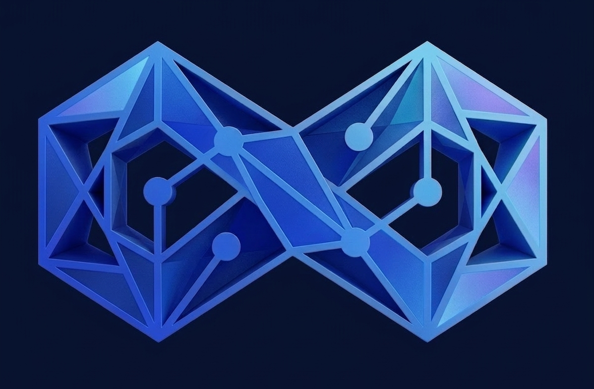

<div align="center">



# EternoMind

### Self-Optimizing Memory-Aware AI Runtime

*Memory IS the optimization. Every interaction makes the AI cheaper, faster, and smarter.*

[](https://www.python.org)
[](https://fastapi.tiangolo.com)
[](https://react.dev)
[](https://www.typescriptlang.org)
[](#license)

[Demo](#demo) · [Features](#features) · [Quick Start](#quick-start) · [Architecture](#architecture) · [API](#api-reference) · [Contributors](#contributors)

</div>

---

## Overview

EternoMind is an enterprise-grade AI runtime that uses **persistent memory** to continuously reduce the cost and latency of LLM inference. The first interaction with a topic uses ~15,000 input tokens on a large model. By interaction 10, EternoMind recognizes the user's accumulated context, compresses the prompt, routes to a cheaper model, and answers with **~720 tokens** — a measured **60–95% token reduction** with no loss in answer quality.

The system is built around three production-grade primitives:

- **[Hindsight](https://hindsight.vectorize.io)** — per-user persistent memory banks that survive across sessions
- **[cascadeflow](https://cascadeflow.ai)** — open-source intelligence layer that decides which model to call
- **[Groq](https://console.groq.com)** — sub-second LLM inference for `llama-3.3-70b-versatile` and `llama-3.1-8b-instant`

---

## Features

| Feature | Description |
|---------|-------------|
| **12-step inference pipeline** | LangGraph-orchestrated flow with security, memory retrieval, RAG, prompt optimization, model routing, validation, and memory writeback |
| **Per-user memory banks** | Each user gets an isolated Hindsight bank (`eternomind-{user_id}`) — memories are private and persistent |
| **Adaptive model routing** | cascadeflow auto-selects between large/small/expert models based on memory coverage and prompt complexity |
| **Manual model override** | Frontend dropdown to force a specific Groq model (Auto, Fast, Balanced, Expert, Reasoning) |
| **Real-time token analytics** | Live Recharts dashboard with input/output tokens, cost in USD, savings %, and per-step latency |
| **JWT authentication** | Stateless auth with access + refresh tokens, bcrypt password hashing |
| **Rate limiting** | Redis-backed sliding window — 60 req/min on `/chat`, 10 req/min on `/auth/login` |
| **Input safety** | Prompt injection detection, HTML sanitization, configurable safety thresholds |
| **Server-Sent Events streaming** | Token-level streaming from Groq with pipeline_step events for live UI updates |
| **Cinematic UI** | TailwindCSS + Canela serif typography, ambient glow orbs, smooth animations matching the landing experience |

---

## The 12-Step Pipeline

Every user message flows through this ordered pipeline:

| # | Step | Description |
|---|------|-------------|
| 1 | **Security** | Input sanitization, HTML strip, prompt-injection detection, rate-limit enforcement |
| 2 | **LangGraph Orchestration** | State machine entry; coordinates all downstream nodes |
| 3 | **Memory Retrieval** | Hindsight async recall against the user's memory bank |
| 4 | **Context Relevancy** | Score and filter memories — keep only those above the relevance threshold |
| 5 | **RAG Retrieval** | ChromaDB embedded similarity search for supporting documents (top-5) |
| 6 | **Prompt Optimizer** | Compress context (top-3 memories + top-2 RAG docs), estimate tokens, classify complexity |
| 7 | **cascadeflow Routing** | Decide model: small (memory-rich) or large (cold start, complex, security-sensitive) |
| 8 | **Groq Inference** | Async streaming completion with token-level deltas |
| 9 | **Validation** | Detect error patterns; retry once on failure |
| 10 | **Response Streaming** | SSE wire protocol — `pipeline_step`, `token`, `done`, `error` |
| 11 | **Memory Update** | Write Q+A pair back to Hindsight as a new memory |
| 12 | **Logging** | Insert row into `interaction_logs` (tokens, model, latency, memory hits) |

---

## Demo

| Interaction | Input Tokens | Model | Latency | Memory Hits |
|-------------|-------------:|-------|--------:|------------:|
| 1 | 670 | `llama-3.3-70b-versatile` | 6.9 s | 0 |
| 2 | 552 | `llama-3.1-8b-instant` | 4.1 s | 7 |
| 5 | 286 | `llama-3.1-8b-instant` | 2.1 s | 23 |
| 10 | **268** | `llama-3.1-8b-instant` | **1.5 s** | 43 |

→ **60% input-token reduction**, model auto-switched on interaction 2, **4× latency improvement**.

---

## Tech Stack

| Layer | Technology |
|-------|-----------|
| Backend API | Python 3.11+, FastAPI, Uvicorn |
| Agent Orchestration | LangGraph, LangChain |
| Persistent Memory | Hindsight SDK (`hindsight-client`) |
| Vector Store | ChromaDB (embedded `PersistentClient`) |
| Relational DB | SQLite + Alembic |
| Model Routing | cascadeflow (open-source library) |
| LLM Inference | Groq |
| Caching / Rate Limiting | Redis (or Valkey) |
| Auth | python-jose (JWT) + bcrypt |
| Frontend | React 19, Vite 8, TypeScript 5, TailwindCSS 3 |
| Charts | Recharts |
| State | Zustand |
| Icons | Material Symbols, lucide-react |
| Infrastructure | Docker Compose |

---

## Architecture

```
┌─────────────────────────────────────────────────────────┐
│ Frontend (React + Vite + Tailwind)         port 5173    │
│  • Chat panel with SSE streaming                        │
│  • Dashboard: token chart · pipeline · metrics          │
└────────────────────────┬────────────────────────────────┘
                         │ HTTP / SSE
┌────────────────────────▼────────────────────────────────┐
│ Backend (FastAPI)                          port 8000    │
│  ┌─────────────────────────────────────────────┐        │
│  │ /auth · /sessions · /health · /models       │        │
│  └─────────────────────────────────────────────┘        │
│  ┌─────────────────────────────────────────────┐        │
│  │ POST /chat → LangGraph 11-step pipeline     │        │
│  │   ↓                                          │        │
│  │   Hindsight ←→ ChromaDB ←→ cascadeflow      │        │
│  │                    ↓                         │        │
│  │              Groq streaming                  │        │
│  └─────────────────────────────────────────────┘        │
│  • interaction_logs (SQLite + Alembic)                  │
└─────────────────────────────────────────────────────────┘
        ↑                              ↑
  Redis (rate limit)         Hindsight Cloud (memory)
```

### Repository Layout

```
eternomind/
├── README.md
├── docker-compose.yml
├── .env.example
│
├── backend/
│   └── app/
│       ├── api/            # FastAPI routers (auth, chat, sessions, health, metrics, models)
│       ├── agents/         # LangGraph state machine + 8 pipeline nodes
│       ├── memory/         # Hindsight SDK wrapper
│       ├── rag/            # ChromaDB client + retriever
│       ├── optimization/   # Prompt optimizer, cascadeflow router
│       ├── runtime/        # Pipeline orchestrator
│       ├── security/       # Auth, sanitization, rate limiting
│       ├── db/             # SQLAlchemy models, Alembic migrations
│       ├── schemas/        # Pydantic request/response models
│       ├── utils/          # Pricing helpers
│       └── main.py         # FastAPI app entry
│
└── frontend/
    └── src/
        ├── components/
        │   ├── auth/       # LoginScreen
        │   ├── landing/    # LandingPage
        │   ├── chat/       # ChatInterface, MessageBubble, StreamingText, ModelSelector
        │   └── dashboard/  # TokenSavingsChart, PipelineStepsPanel, MetricsBar
        ├── hooks/          # useChat, useMetrics, useSSE
        ├── stores/         # Zustand: chatStore, sessionStore, metricsStore
        ├── api/            # Fetch wrappers for backend calls
        └── lib/            # Model metadata, pricing utilities
```

---

## Prerequisites

- **Python** 3.11 or newer
- **Node.js** 18 or newer
- **Redis** (or Valkey on Arch) — install natively or via Docker
- **API keys** (free tiers available):
  - [Groq](https://console.groq.com) — `GROQ_API_KEY`
  - [Hindsight](https://hindsight.vectorize.io) — `HINDSIGHT_API_KEY`
  - cascadeflow does **not** require a separate key (open-source library)

---

## Quick Start

```bash
# 1. Clone
git clone https://github.com/Preethesh16/EternoMind.git
cd EternoMind

# 2. Backend
cd backend
python3 -m venv .venv
.venv/bin/pip install -r requirements.txt

# 3. Configure
cp ../.env.example .env
# Edit .env and add: GROQ_API_KEY, HINDSIGHT_API_KEY
# Generate SECRET_KEY: openssl rand -hex 32

# 4. Database + demo data
.venv/bin/alembic upgrade head
.venv/bin/python scripts/seed_demo_user.py        # creates demo / demo1234
.venv/bin/python scripts/ingest_demo_docs.py      # seeds ChromaDB

# 5. Redis (native — works around Docker port-forwarding issues)
sudo pacman -S redis            # Arch
# OR: sudo apt install redis    # Debian/Ubuntu
redis-server --port 6379 &

# 6. Start backend
.venv/bin/uvicorn app.main:app --reload
# → http://localhost:8000
# → http://localhost:8000/docs (Swagger UI)

# 7. Frontend (in a new terminal)
cd ../frontend
npm install
npm run dev
# → http://localhost:5173
```

Log in with `demo` / `demo1234` and start chatting.

---

## API Reference

All API endpoints are versioned under `/api/v1`.

### Authentication

```http
POST /api/v1/auth/login              # username + password → access + refresh tokens
POST /api/v1/auth/refresh            # refresh token → new access token
POST /api/v1/auth/logout             # client-side stateless logout
```

### Sessions

```http
POST /api/v1/sessions                # create new chat session (auth required)
GET  /api/v1/sessions/{session_id}   # get session details + interaction count
```

### Chat (SSE)

```http
POST /api/v1/chat                    # body: { session_id, message, user_id, model? }
                                     # streams: pipeline_step, token, done, error
```

### Metrics

```http
GET /api/v1/metrics/{session_id}     # interaction history with tokens, model, latency
```

### Operational

```http
GET /api/v1/health                   # backend, redis, chromadb status
GET /api/v1/models                   # available Groq models for the selector
```

### SSE Wire Format

```
event: pipeline_step
data: {"step": "memory_retrieval", "status": "running"}

event: token
data: {"step": "response", "token_delta": "Hello"}

event: done
data: {"total_tokens": 268, "model": "llama-3.1-8b-instant", "latency_ms": 1547.3, "memory_hits": 43, "estimated_cost": 0.00002}
```

### `interaction_logs` Schema

| Column | Type | Notes |
|--------|------|-------|
| id | INTEGER | PK auto-increment |
| session_id | TEXT | FK → sessions |
| user_id | TEXT | — |
| interaction_number | INTEGER | per-session counter |
| token_count_input | INTEGER | from Groq usage |
| token_count_output | INTEGER | from Groq usage |
| model_used | TEXT | resolved Groq model |
| memory_hits | INTEGER | filtered Hindsight matches |
| latency_ms | REAL | end-to-end pipeline latency |
| created_at | DATETIME | UTC, server default |

---

## Demo Walkthrough

1. Open `http://localhost:5173`
2. Sign in with `demo` / `demo1234`
3. Ask: *"Explain how transformer attention mechanisms work"* → ~670 tokens, large model, ~7 s
4. Ask 4–9 follow-up questions on the same topic
5. By interaction 10, observe:
   - Input tokens **drop to ~268**
   - Model badge turns **green** (small model)
   - Latency falls below **2 seconds**
   - Token Savings Chart shows the full downward curve
   - "Saved $X.XX" cost counter grows
6. Click **Reset Session** and ask the original question again — token count returns to ~670 (proving the optimization is memory-driven, not response caching)

---

## Configuration

Required environment variables (see `.env.example`):

```bash
# JWT
SECRET_KEY=<openssl rand -hex 32>
ACCESS_TOKEN_EXPIRE_MINUTES=30
REFRESH_TOKEN_EXPIRE_DAYS=7
ALGORITHM=HS256

# Database
DATABASE_URL=sqlite:///./eternomind.db

# Redis
REDIS_URL=redis://localhost:6379/0

# ChromaDB (embedded by default)
CHROMA_HOST=localhost
CHROMA_PORT=8001
CHROMA_USE_HTTP=false           # set true for Docker/production HTTP mode

# Provider keys
GROQ_API_KEY=gsk_...
HINDSIGHT_API_KEY=hsk_...
# cascadeflow needs no key — uses GROQ_API_KEY directly

# Models
GROQ_LARGE_MODEL=llama-3.3-70b-versatile
GROQ_SMALL_MODEL=llama-3.1-8b-instant

# CORS
CORS_ORIGINS=http://localhost:5173
```

---

## Contributors

Built for the **Building AI Agents with Hindsight & cascadeflow** hackathon.

| Name | Role | Domain |
|------|------|--------|
| **Preethesh Carvalho** | Backend Core | FastAPI scaffold, SQLite + Alembic, JWT auth, security middleware, sessions, health, integration testing |
| **Imran Kazia** | AI / Agent Pipeline | LangGraph state machine, Hindsight memory, ChromaDB RAG, prompt optimizer, cascadeflow routing, Groq inference |
| **Deepthi C J** | Frontend & Integration | React UI, chat streaming, token-savings chart, pipeline panel, model selector, Docker Compose |
| **Navya** | Design & Product | UI/UX direction, landing page concept, design system, demo storytelling |
| **Abhinav** | Design & Product | Visual design, brand identity, dashboard layout, animations |

---

## License

Released under the [MIT License](https://opensource.org/licenses/MIT). Built with ❤️ for the *Building AI Agents with Hindsight & cascadeflow* hackathon.
